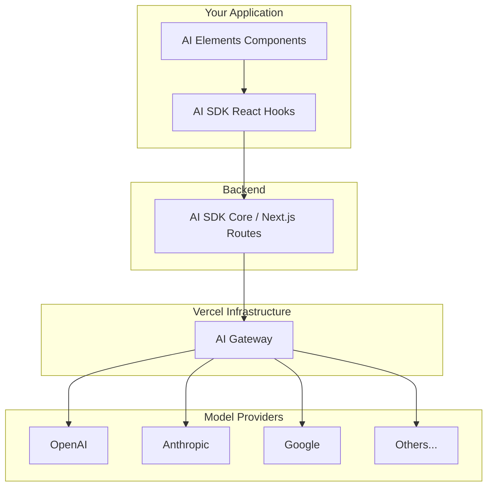

Vercel provides a complete stack for building AI-powered applications. Here's how the pieces fit together.

## The Stack



## AI Gateway

[AI Gateway](https://vercel.com/docs/ai-gateway) is your single point of access to AI models.

### What It Does

- **Unified API** - One API key for OpenAI, Anthropic, Google, and more
- **Caching** - Reduce costs by caching identical requests
- **Rate limiting** - Protect your application from abuse
- **Observability** - Monitor usage, latency, and costs
- **Fallbacks** - Automatically retry with backup models

### Setup

Add `AI_GATEWAY_API_KEY` to your environment:

```bash title=".env.local"
AI_GATEWAY_API_KEY=your_api_key_here
```

Then use it with the AI SDK by specifying a model string e.g. `anthropic/claude-sonnet-4.5`.

## AI SDK

The [AI SDK](https://ai-sdk.dev/) provides the foundation for AI interactions.

### Core Features

- **Streaming** - Stream responses from any model
- **Tool calling** - Let models call functions
- **Structured output** - Get typed responses
- **Multi-modal** - Handle text, images, and files

### React Hooks

```tsx title="example.tsx"
"use client";

import { useChat } from "@ai-sdk/react";

function Chat() {
  const [text, setText] = useState("");
  const { messages, sendMessage, status } = useChat({
    transport: new DefaultChatTransport({
      api: "/api/chat",
    }),
  });

  const handleSubmit = (e: React.FormEvent) => {
    e.preventDefault();
    sendMessage({ text: text });
    setText("");
  };

  return (
    <form onSubmit={handleSubmit}>
      {messages.map((m) => (
        <div key={m.id}>{m.content}</div>
      ))}
      <input value={text} onChange={(e) => setText(e.target.value)} />
    </form>
  );
}
```

### Server Integration

```ts title="app/api/chat/route.ts"
import { streamText } from "ai";

export async function POST(req: Request) {
  const { messages } = await req.json();

  const result = streamText({
    model: "anthropic/claude-sonnet-4.5",
    system: "You are a helpful assistant.",
    messages: await convertToModelMessages(messages),
  });

  return result.toUIMessageStreamResponse();
}
```

## AI Elements

AI Elements provides the UI layer on top of the AI SDK.

### What It Adds

- **Pre-built components** - Message, Conversation, PromptInput, and more
- **Streaming support** - Components handle partial content gracefully
- **Composable design** - Build exactly the UI you need
- **Theme integration** - Works with your existing shadcn/ui setup

### Integration Example

```tsx title="app/chat/page.tsx"
"use client";

import { useChat } from "@ai-sdk/react";
import {
  Conversation,
  ConversationContent,
} from "@/components/ai-elements/conversation";
import {
  Message,
  MessageContent,
  MessageResponse,
} from "@/components/ai-elements/message";
import {
  PromptInput,
  PromptInputBody,
  PromptInputFooter,
  PromptInputProvider,
  PromptInputSubmit,
  PromptInputTextarea,
} from "@/components/ai-elements/prompt-input";

export default function ChatPage() {
  const { messages, sendMessage, status } = useChat({
    transport: new DefaultChatTransport({
      api: "/api/chat",
    }),
  });

  const handleSubmit = (message: { text: string }) => {
    sendMessage({ text: message.text });
  };

  return (
    <div className="h-screen flex flex-col">
      <Conversation className="flex-1">
        <ConversationContent>
          {messages.map((message) => (
            <Message key={message.id} from={message.role}>
              <MessageContent>
                {message.parts.map((part, i) =>
                  part.type === "text" ? (
                    <MessageResponse key={i}>{part.text}</MessageResponse>
                  ) : null,
                )}
              </MessageContent>
            </Message>
          ))}
        </ConversationContent>
      </Conversation>

      <PromptInputProvider>
        <PromptInput onSubmit={handleSubmit} className="p-4">
          <PromptInputBody>
            <PromptInputTextarea placeholder="Type a message..." />
          </PromptInputBody>
          <PromptInputFooter>
            <PromptInputSubmit status={status} />
          </PromptInputFooter>
        </PromptInput>
      </PromptInputProvider>
    </div>
  );
}
```

## Putting It Together

The full flow:

1. **User types** in an AI Elements `PromptInput`
2. **React hook** (`useChat`) sends the message to your API route
3. **AI SDK** streams the response from the model via AI Gateway
4. **AI Elements** renders the streaming response in `MessageResponse`

Each layer handles its responsibility:

| Layer       | Responsibility                        |
| ----------- | ------------------------------------- |
| AI Gateway  | Model access, caching, observability  |
| AI SDK      | Streaming, hooks, server integration  |
| AI Elements | UI components, theming, accessibility |

This separation means you can swap any layer independently. Use a different model provider, build custom hooks, or create your own components—the stack remains flexible.
